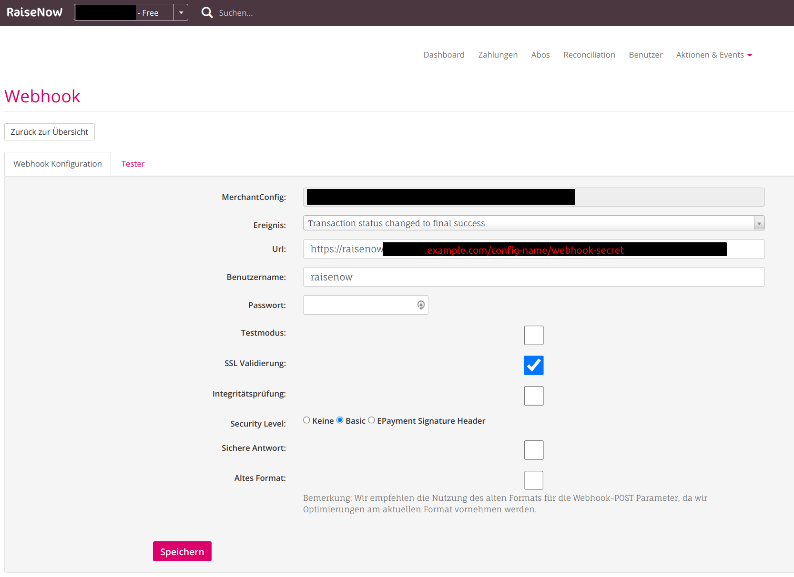

# RaiseNow Service

The glue between RaiseNow and Webling:

- Match RaiseNow donations to member records in Webling
- Add the member record, if no matches were found
- Record the donation in Webling's accounting system

## What it does (and how) in more detail

- RaiseNow calls this service in a Webhook. 
- The RaiseNowService extracts the payees data and uses the 
  [WeblingService](https://github.com/grueneschweiz/weblingservice) to find the
  corresponding member record in webling.
  - If multiple records match, the main record is selected
  - If non match, a new record is created
  - If we've got ambiguous matches, the accountant is informed by email and the
    RaiseNowService **terminates** here
- The member record found in Webling is completed:
  - Empty name, address, language, salutation fields are filled (`addIfEmpty`)
  - The record is marked as donor
  - If the newsletter subscription was selected, the newsletter is set to yes
    (if no subscription was selected, nothing happens, so no unsubscription)
- The RaiseNowService connects directly to Webling's API for processing the
  financial data.
- It first gets the accounting period for the given payment.
- It then detects the correct accounts for the payment entry. This response is
  cached in `storage/app/cache` for an unlimited time.
- Afterwards, it checks if the payment entry already exists in Webling. If not 
  it is added to Webling. The entry is linked to the matched member.

## Design Decisions

- We aimed for a low-maintenance service, so we reduced the dependencies to
  very few. Therefore, this service does not use a framework. It is, however,
  inspired by Laravel.
- For the sake of simplicity, we have dispensed some best practices like 
  dependency injection.
- To reduce the attack surface, this service should run behind basic auth see
  [Configuration](#configuration).
- Just in case, anything goes wrong, the oAuth tokens for the WeblingService
  are AES-256-GCM encrypted at rest.
- The tests are not very sophisticated. They check mainly the business logic
  and not every value in every call of an API.
- In case any payment can't be processed, the accountant gets notified by email.
  If the error seems to need any config or system change, the admin is also 
  notified.

## Configuration

### RaiseNow Webhook

Configure it as shown in the following screenshot, whereas `config-name` 
reflects the array key in `config.php` (`here-we-donate.com` in 
`config.example.php`) and `webhook-secret` corresponds to 
`$config[$configName]['webhookSecret']`:

Make sure you do also add the basic auth credentials.

### RaiseNowService

Grab a copy of [`/config.example.php`](config.example.php) and save it as
`/config.php`.

Most things in `/config.example.php` are self-explanatory. For the other ones, 
read on ;)

- `here-we-donate.com` the RaiseNowService can serve different instances. This
  key identifies them. Use the name of the site, where the donations primarily
  come from. The same key must be used in the configuration of the 
  [RaiseNow Webhook](#raisenow-webhook) as the first element of the url path.
- `logLevel` accepts `DEBUG`, `INFO`, `NOTICE`, `WARNING`, `ERROR`, `CRITICAL`, 
  `ALERT` and `EMERGENCY`. It specifies the lowest level, that is logged.
- `webhookSecret` is a string you can define. We recommend 32 random
  alphanumerical chars. The same key must be used in the configuration of the
  [RaiseNow Webhook](#raisenow-webhook) as the second element of the url path.
- `periodGroupId`, `donationAccountTemplateId`, `debtorAccountTemplateId`,
  `bankAccountTemplateId` and `debtorCategoryId` are easiest to be detected via
  Webling's API browser (`yourinstance.webling.ch/browser`).
- `groupIdForNewMembers` id of the group in Webling, where newly added member 
  records should be stored.
- `tokenEncryptionKey` any string. We recommend 32 random alphanumerical chars.
